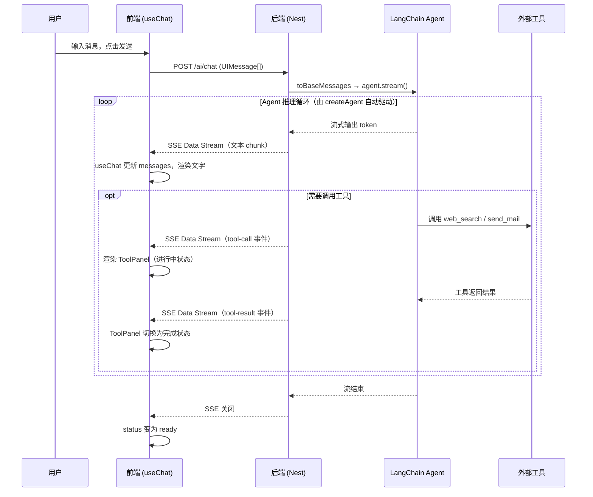

# AGUI 完整流程

> 创建时间：2026 年 5 月 5 日

## 流程图



## 分层说明

### 后端

**`src/ai/ai.controller.ts`** — 路由入口

接收前端 POST 过来的 `UIMessage[]`，调 `aiService.stream()`，再用 `pipeUIMessageStreamToResponse` 把结果以 SSE 形式写回 Response。不关心 Agent 内部逻辑，只负责接入和透传。

**`src/ai/ai.service.ts`** — Agent 核心

- `toBaseMessages(messages)`：将前端格式的 `UIMessage[]` 转成 LangChain 的 `BaseMessage[]`
- `createAgent({ model, tools, systemPrompt })`：直接创建 Agent，不手写循环——工具调用、结果回填、多轮推理全部由 `createAgent` 内部驱动
- `agent.stream()`：启动流式推理，产出 LangChain 原生流
- `toUIMessageStream(lgStream)`：`@ai-sdk/langchain` 提供的桥接函数，把 LangChain 流转换为 Vercel AI SDK 的 **Data Stream Protocol** 格式

**工具（注入到 AiService）**
- `web_search`：联网搜索，结果以文本形式返回
- `send_mail`：调 Nodemailer 发邮件，结果返回发送状态

### 前端

**`src/App.tsx`** — 主页面

用 `@ai-sdk/react` 的 `useChat` 对接后端 SSE 流。`useChat` 自动处理请求发送、流式接收、消息状态管理，对外暴露 `messages` 数组。每条消息由 `parts` 组成，一条助手消息里可以同时包含多个 `text` part 和多个 `tool` part。

**`src/components/StreamdownText.tsx`** — 文本流式渲染

`text` 类型的 part 交给 `streamdown` 库渲染。`isAnimating` 在流式输出时为 true，让 Markdown 边生成边解析——表格、代码块、Mermaid 流程图等语法不会等全部输出完才显示。

**`src/components/ToolPanels.tsx`** — 工具调用渲染

`tool` 类型的 part 根据 `state` 和工具名称分发到不同组件：

| 状态               | 渲染                                |
| ------------------ | ----------------------------------- |
| `input-streaming`  | 显示参数流式生成中（带光标动画）    |
| `input-available`  | 参数已就绪，等待执行                |
| `output-available` | 展示完整结果（搜索列表 / 邮件详情） |
| `output-error`     | 显示错误信息                        |

`web_search` 结果解析成带引用、标题、URL、摘要的卡片列表；`send_mail` 展示收件人、主题、正文预览及发送状态。

## 前端消息类型与状态判断

### 第一层：part.type 区分文本还是工具

`useChat` 把每条助手消息的内容拆成 `parts` 数组，`App.tsx` 遍历时把每个 part 交给 `MessagePart` 组件，第一个判断就是 `part.type`：

```
part.type === 'text'       → StreamdownText（流式 Markdown 渲染）
isToolUIPart(part) === true → ToolMessagePart（工具调用渲染）
其他                        → null（不渲染）
```

`text` part 还需要额外判断是否处于**流式输出中**（`textStreamActive`），条件是：同时满足「是最后一条助手消息」「是该消息最后一个 text part」「当前 status 为 streaming/submitted」。只有满足这三个条件，才给 `StreamdownText` 传 `isStreaming=true`，开启逐字动画；否则为 `false`，静态渲染。

### 第二层：part.state 区分工具所处阶段

`ToolMessagePart` 拿到工具 part 后，先看 `part.state`：

```
output-error        → ToolErrorPanel（直接显示错误，流程终止）
非 output-available  → 进行中（input-streaming 或 input-available）
output-available    → 完成，展示完整结果
```

### 第三层：工具名称决定用哪个组件

进行中和完成状态都会再按工具名称（`getToolName(part)`）分发：

```
进行中阶段：
  send_mail  → SendMailToolPanel（progress='input-streaming'/'input-available'，显示参数流式生成）
  其他        → ToolPendingPanel（显示"正在调用 xxx"，附带关键参数提示）

完成阶段（output-available）：
  web_search → WebSearchToolPanel（解析成引用卡片列表）
  send_mail  → SendMailToolPanel（显示收件人/主题/正文及发送结果）
  其他        → DefaultToolOutput（原始 JSON 输出）
```

### 完整判断树

```
MessagePart(part)
├── part.type === 'text'
│     └── StreamdownText
│           └── isStreaming = (最后一条助手消息 & 最后一个 text part & 正在 streaming)
│
└── isToolUIPart(part)
      └── ToolMessagePart(part)
            ├── state === 'output-error'
            │     └── ToolErrorPanel
            │
            ├── state !== 'output-available'（进行中）
            │     ├── name === 'send_mail' → SendMailToolPanel(progress)
            │     └── 其他                → ToolPendingPanel(hint)
            │
            └── state === 'output-available'（完成）
                  ├── name === 'web_search' → WebSearchToolPanel
                  ├── name === 'send_mail'  → SendMailToolPanel
                  └── 其他                 → DefaultToolOutput
```

## 关键设计点

**`createAgent` 取代手写循环**
过去需要自己实现「调模型 → 检查是否有 tool_call → 执行工具 → 把结果塞回 messages → 再调模型」的循环。现在 `createAgent` 封装了这一切，业务代码只需要声明用哪些工具，其余交给框架。

**`@ai-sdk/langchain` 协议桥接**
后端用 LangChain 写 Agent，前端用 Vercel AI SDK 消费，两者之间靠 `toBaseMessages` + `toUIMessageStream` 做格式转换，使 LangChain 的流输出符合 Data Stream Protocol，前端 `useChat` 才能正确解析。

**Data Stream Protocol 统一事件流**
SSE 流里不只有文本 token，还有结构化的 `tool-call`、`tool-result`、`finish` 等事件。`useChat` 解析这些事件后，把每条消息组装成带 `parts` 的 `UIMessage`，前端只需按 `part.type` 做分支渲染，不需要自己解析原始 SSE。
