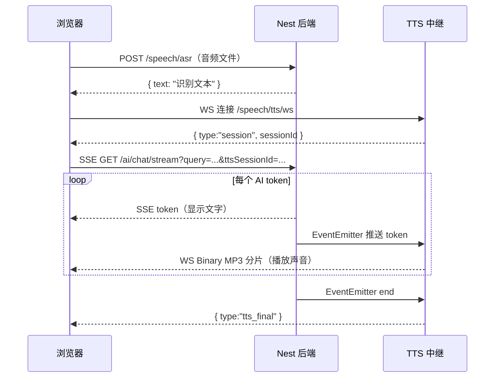

# ASR + AI + TTS 流程图

流程总结：
浏览器先把录音 POST 给 Nest，Nest 调腾讯云 ASR 拿回识别文本。同时浏览器和 TTS 中继建好 WebSocket 连接，拿到 sessionId。之后浏览器带着文本和 sessionId 发起 SSE 请求，Nest 开始流式调用大模型——每产出一个 token，一方面通过 SSE 推给浏览器显示文字，另一方面通过 EventEmitter 把 token 发给 TTS 中继；TTS 中继收到 token 后转发给腾讯云 TTS，腾讯云合成 MP3 分片返回给中继，中继再通过已建好的 WebSocket 把 MP3 透传给浏览器；浏览器用 MediaSource 持续追加分片，边收边播。最终效果是：文字和声音几乎同步出现，AI 说的话比文字只慢一点点。

## 流程与代码文件对照

| 流程步骤 | 负责文件 |
|----------|----------|
| 浏览器录音、发请求、播放音频 | `public/asr-ai-stream.html` |
| WebSocket 适配器挂载（启动 /speech/tts/ws） | `src/main.ts` |
| POST /speech/asr 路由入口 | `src/speech/speech.controller.ts` |
| 调腾讯云 ASR、拿回识别文本 | `src/speech/speech.service.ts` |
| SSE GET /ai/chat/stream 路由入口 | `src/ai/ai.controller.ts` |
| 调 LangChain 流式大模型、逐 token yield + EventEmitter 广播 | `src/ai/ai.service.ts` |
| EventEmitter 事件协议定义（start / chunk / end / error） | `src/common/stream-events.ts` |
| 订阅事件、管理腾讯 TTS WebSocket、缓冲 pendingChunks、透传 MP3 给浏览器 | `src/speech/tts-relay.service.ts` |
